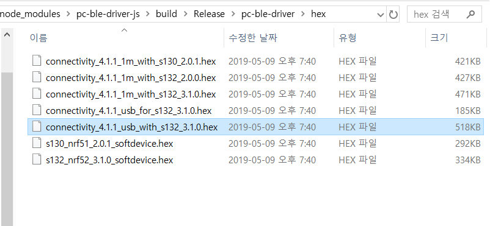
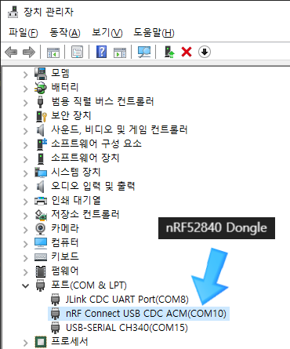
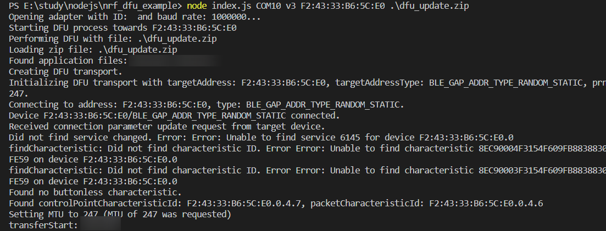
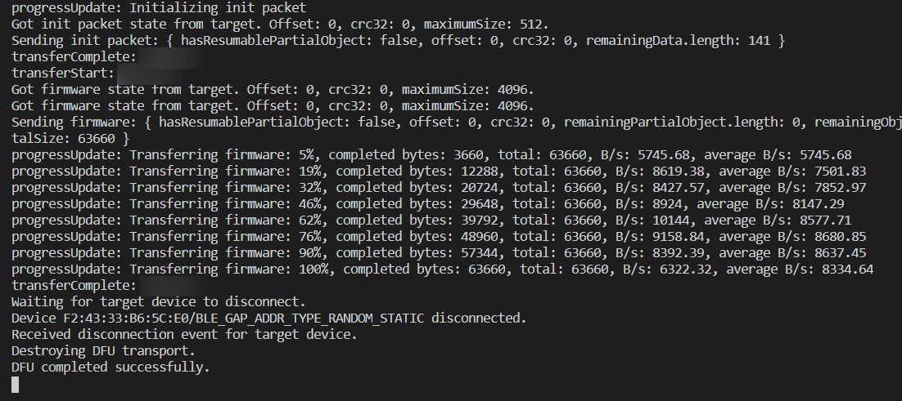

nrf_dfu_example_js
==================

Requirements
------------
    Node.Js Version : 11.xx.x (Important)
    nRF52840 Dongle 

1. Download and Install package -------------------------------------------------------------
<pre><code>
git clone https://github.com/chandong83/pc-nrf-dfu-example-js 
cd pc-nrf-dfu-example-js
npm install
</code></pre>

2. write firmware for pc-ble-driver to nRF52840 Dongle firmware
-------------------------------------------------------------
you can find the path below.   
<pre><code>
nrf-dfu-example_js\node_modules\pc-ble-driver-js\build\Release\pc-ble-driver\hex\connectivity_4.1.1_usb_with_s132_3.1.0.hex   
</code></pre>

please write that file to nRF52840 dongle in any way(nRF Connect...).   
then in Device Manager it will look like the image below.   

 

How to Run
<pre><code>
node index.js [COM PORT of nRF52840 Dongle] [SD Version v2 or v3] [MAC Address] [DFU file]
</code></pre>
   
Ex>

    nRF52840 Dongle : COM10
    
    SD version : v3 (nRF52) 
    
    MAC address of the device to upload : F2:43:33:B6:5C:E0
    
    DFU file : dfu_update.zip

<pre><code>
> node index.js COM10 v3 F2:43:33:B6:5C:E0 .\dfu_update.zip
</code></pre>    
    

 

Korean Blog Link     
https://blog.naver.com/chandong83/221784143334